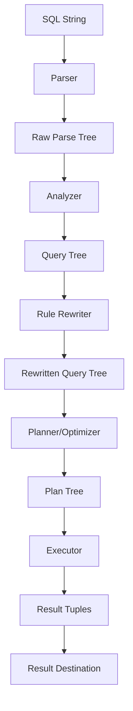
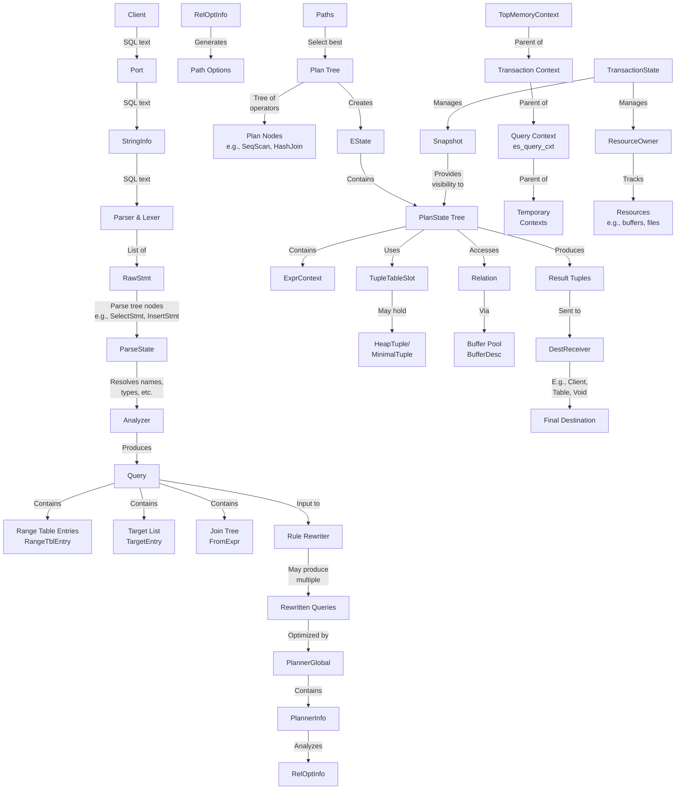
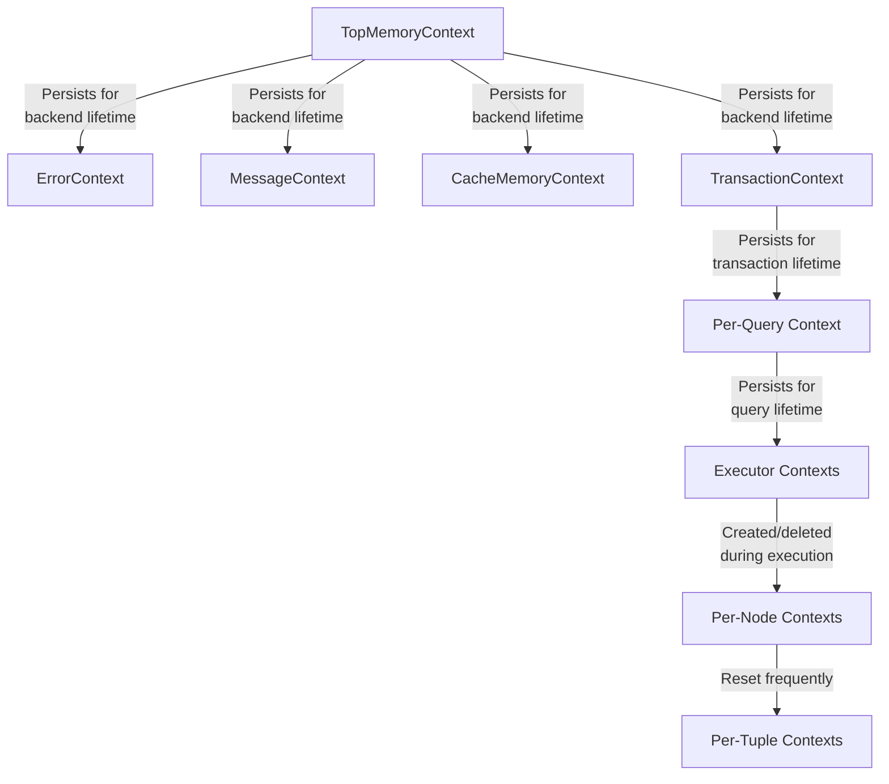
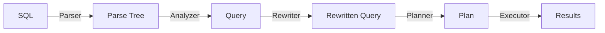

# PostgreSQL SQL Statement Processing: Data Flow Diagram

This document provides a visual representation of how data flows through PostgreSQL's key data structures during SQL statement processing. The diagram illustrates the transformation of a SQL statement from text to execution results.

## High-Level Data Flow

## Detailed Data Flow with Key Data Structures

## Key Structure Relationships during SQL Processing

### Parsing Stage
- **StringInfo** holds the SQL text
- **Parser** produces syntax tree with nodes like **SelectStmt**, **InsertStmt**, etc.
- These raw nodes are collected in a **List** structure within a **RawStmt**

### Analysis Stage
- **ParseState** is created to hold state during analysis
- Raw parse tree is transformed into a **Query** structure with:
  - **RangeTblEntry** list (relations referenced)
  - **TargetEntry** list (output columns)
  - **FromExpr** (join tree structure)
  - Various condition expressions

### Planning Stage
- **PlannerGlobal** and **PlannerInfo** hold state during planning
- **RelOptInfo** structures represent each base relation and join
- **Path** structures represent possible access methods
- The best path combination is transformed into a **Plan** tree

### Execution Stage
- **EState** holds the overall execution state
- Each plan node has a corresponding **PlanState** node with runtime state
- **TupleTableSlot** holds tuples as they flow between nodes
- **HeapTuple** or **MinimalTuple** represent actual row data
- **ExprContext** evaluates expressions on current tuples
- **DestReceiver** directs output to its final destination

### Memory Management
- All allocations happen in proper **MemoryContext** hierarchies
- The context hierarchy ensures memory is freed at appropriate times

## Data Flow Through Memory Management

## Horizontal View of Query Processing Pipeline

Each stage in the pipeline transforms the representation of the query, from textual SQL to raw syntax trees, to analyzed query trees, to optimized execution plans, and finally to result tuples. The data structures detailed above facilitate these transformations and maintain state throughout the process.
